# Test Results Images

This document contains all the generated LGTM images from the test results.

## Extreme Aspect Ratios

### Extreme Tall

### Extreme Wide

### Ultra Tall

### Ultra Wide

## Large Images

### Huge Square

### Large Landscape
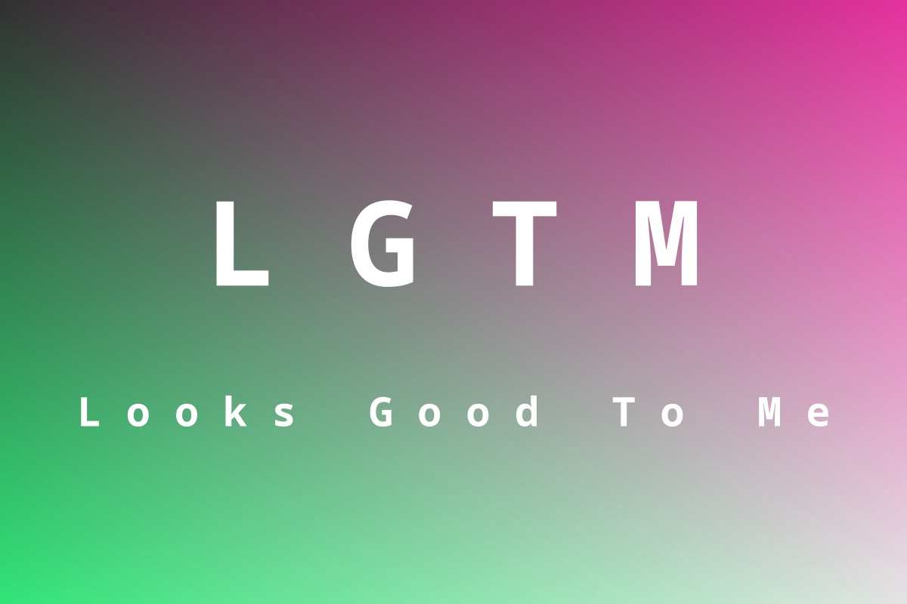

### Large Portrait
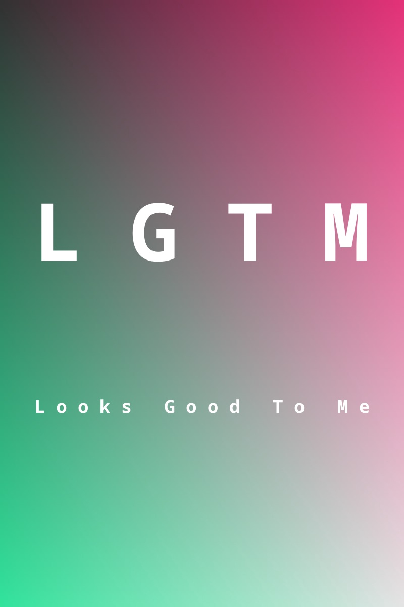

## Small Images

### Micro

### Small

### Tiny

## Rectangle Images

### 300x200 Rectangle

### 400x300 Rectangle
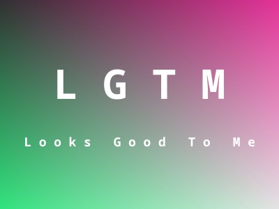

### 500x300 Rectangle
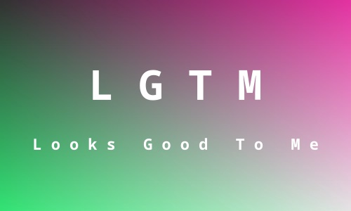

### 600x400 Rectangle

## Ribbon Images

### Horizontal Ribbon

### Vertical Ribbon

## Square Images

### Square

### Square 200
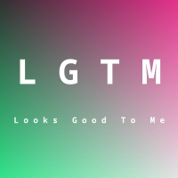

### Square 300
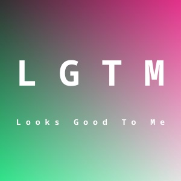

### Square 500
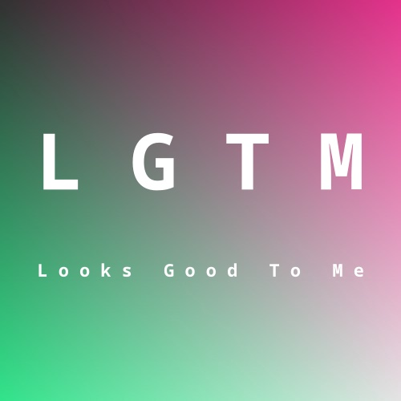

### Square 800
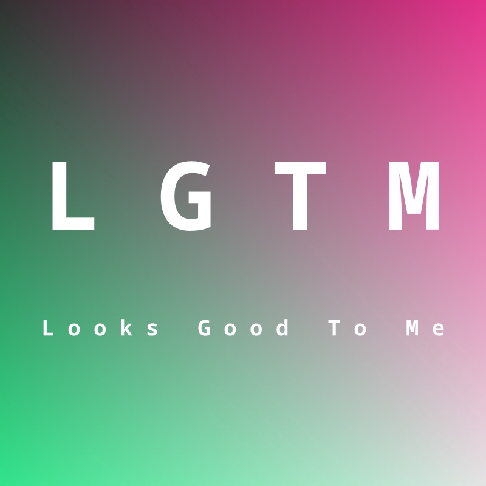

## Tall Images

### Tall

### Tall 2:1
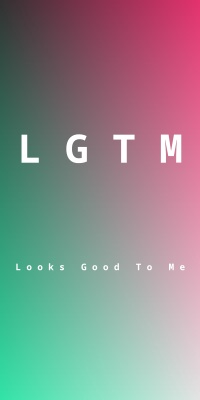

### Tall 3:1
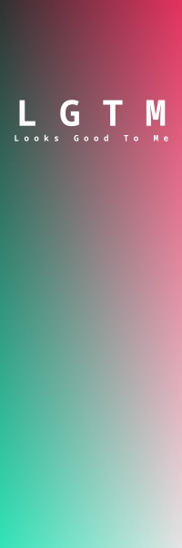

### Tall 4:1
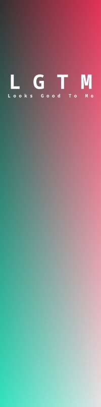

### Tall 5:1
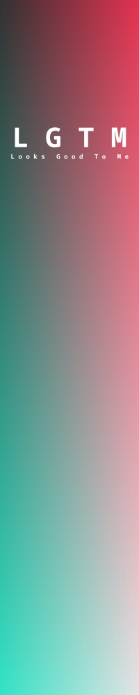

## Thin Images

### Thin Horizontal

### Thin Vertical

## Wide Images

### Wide

### Wide 2:1
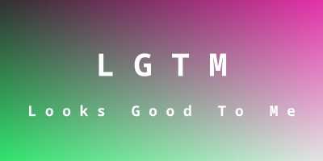

### Wide 3:1

### Wide 4:1

### Wide 5:1
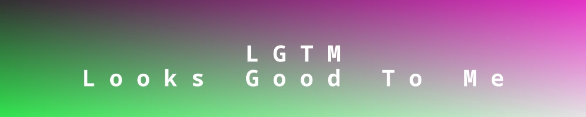